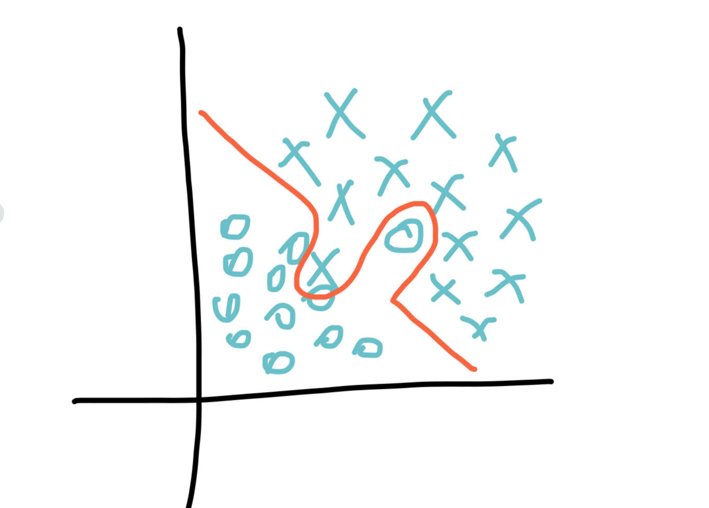

# Improving Deep Neural Networks: Hyperparameter tuning, Regularization and Optimization (Spanish)
## Semana 1
### Train / Dev / Test sets
* Es imposible obtener todos los hiperparámetros correctamente la primera vez.
* Es por eso que se realiza en base al ciclo: Idea -> Código -> Experimento
* Para poder descubrir los hiperparametros de la manera mas optima se debe realizar dicho ciclo muchas veces.
* Los datos (Dataset) deben dividirse en tres partes (train_set, dev_set, test_set)
* El dev_set y el test_set deben venir de una misma distribucion
* Esta bien no tener el dev_set
* Al inicio el modelo debe pasar por el train_set. Luego se optimizarán hiperparámetros en el dev_set. Para finalizar se evaluará el test_set.
* Para una optima división del dataset se pueden seguir los siguientes casos: 
    - Si el dataset consta de 100 a 1000000 registros entonces la division es: 60% para el train_set, 20% para el dev_set y 20% para el test_set.
    - Si el dataset consta con mas de 1000000 registros, la división es la siguiente: 98% para el train_set, 1% para el dev_set y 1% para el test_set.
* El objetivo del dev_set es mejorar el desempeño del modelo.
* Es muy comun omitir el uso del dev_set, suplantandolo con el test_set. 

### Bias/Variance
* Cuando se presenta un alto underfitting, se lo representa como "High Bias"
* Cuando se presenta un alto overfitting, se lo representa como "High Variance"
* La idea es mantener el modelo balanceado entre ambos estándares.
* Ejemplo: Supongamos que estamos haciendo el entrenamiento de un modelo y obtenemos los siguientes resultados:
    - Train_set error: 1% y Dev_set error: 11% -> Parece ser un caso de Overfitting (High Bias).
    - Train_set error: 15% y Dev_set error: 16% -> Parece ser un caso de Underfitting (High Variance).
    - Train_set error: 15% y Dev_set error: 30% -> Parece ser un caso tanto de Underfitting y Overfitting.
    - Train_set error: 0.5% y Dev_set error: 1% -> Parece ser un caso de Bias y Variance bajo.

* Un caso de alto bias y alto variance: 

### Basic Recipe for Machine Learning
* Si el algoritmo presenta un alto Bias:
    - Hacer que la NN sea más grande.
    - Tratar de hacer un entrenamiento mas largo (?)
    - Intentar otros tipos de algoritmos de optimización.
* Si el algoritmo presenta un alto Variance:
    - Obtener mas datos
    - Intentar regularizacion
    - Buscar otro tipo de modelo que se adapte a los datos.

### Regularizacion
A partir de aqui se empieza a usar terminologia de Algebra Lineal, por lo cual es necesario un repaso previo:
<b>Acerca de L1 y L2 Norm </b>
Un Norm en Algebra Lineal se refiere al tamaño total de todos los vectores en un espacio.
Hay distintas manera de medir la magnitud de los vectores:
* <b>L0</b> en realidad no es un Norm, sino corresponde al numero total de numero de elementos nonzero en un vector. Por ejemplo el L0 norm entre los vectores (0,0) y (0,2) es 1, porq hay un elemento nonzero. Una manera practica para entender esto es sobre el username y la contraseña. Si el L0 Norm de los vectores (password y username) es 0, entonces el login fue exitoso. Por otro lado si es 1, entonces significa que o el password o el username es incorrecto. Finalmente, si el L0 es 2, entonces ambos son incorrectos.
* <b>L1</b> tambien conocido como Distancias de Manhattan. Es la suma de magnitudes de los vectores en un espacio. Es la suma de las diferencias absolutas de los componentes de los vectores. En este Norm, todos los componentes del vector son iguales en peso (?). !]

* La implementacion de la regularizacion en nuestro modelo, ayuda a reducir la Variance.
* L1 Matrix norm:
